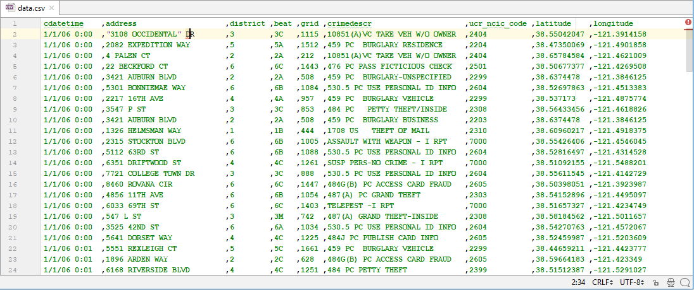
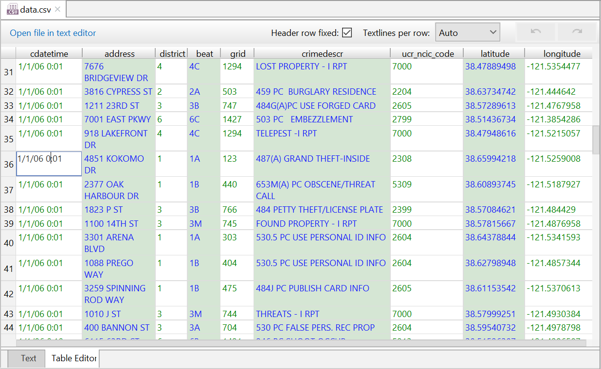
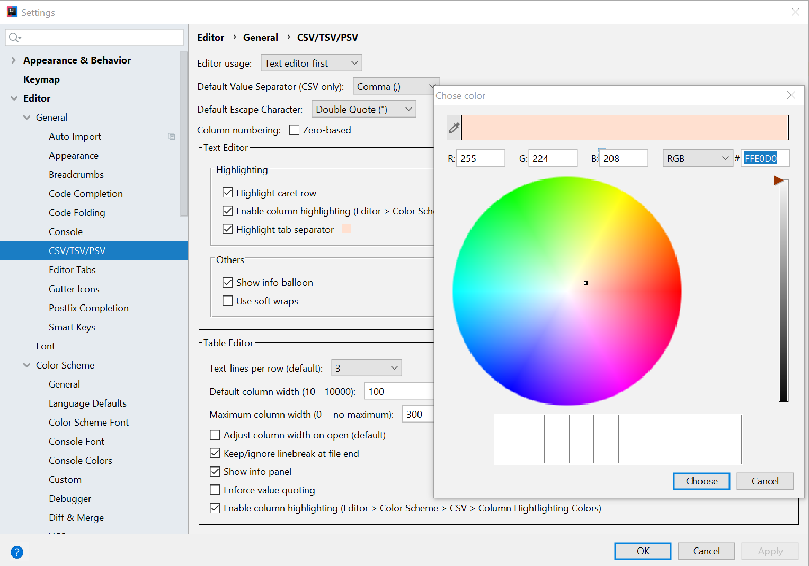
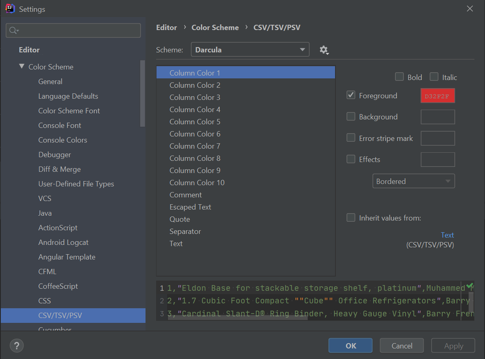
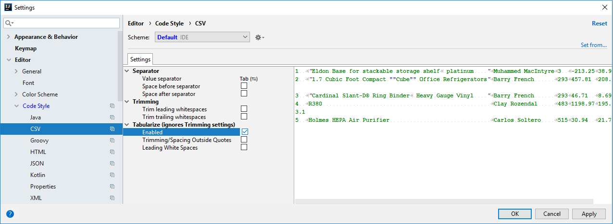
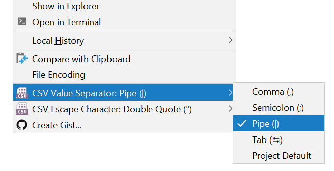
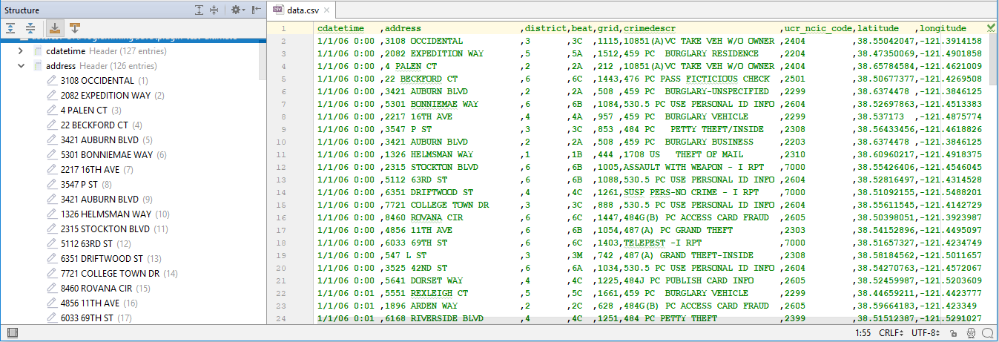

[](https://plugins.jetbrains.com/plugin/10037-csv-plugin)
[](https://travis-ci.org/SeeSharpSoft/intellij-csv-validator)
[](https://coveralls.io/github/SeeSharpSoft/intellij-csv-validator?branch=master)
[](https://snyk.io/test/github/SeeSharpSoft/intellij-csv-validator?targetFile=build.gradle)
[](https://www.codacy.com/app/github_124/intellij-csv-validator?utm_source=github.com&amp;utm_medium=referral&amp;utm_content=SeeSharpSoft/intellij-csv-validator&amp;utm_campaign=Badge_Grade)
[](https://bettercodehub.com/results/SeeSharpSoft/intellij-csv-validator/)

# Lightweight CSV Plugin for JetBrains IDE family

Compatible with _IntelliJ IDEA  PhpStorm  WebStorm  PyCharm  RubyMine  AppCode  CLion  Gogland  DataGrip  Rider  MPS  Android Studio_ - __2016.3.2 and newer__

This plugin introduces CSV (_Comma-Separated Values_) as a language to Jetbrains IDE with a syntax definition, structured language elements and associated file types (.csv/.tsv).
This enables default editor features like syntax validation, highlighting and inspections for CSV files.

## Features

- CSV/TSV file detection
- table editor
- customizable text editor
- syntax validation
- syntax highlighting (customizable)
- content formatting (customizable)
- quick fix inspections
- intentions (Alt+Enter), e.g. Quote/Unquote (all), Shift Column Left/Right
- structure view (header-entry layout)
- support for ',', ';', '|' and '&#8633;' as value separator
- highlight of active column values
- customizable column coloring
- tab (&#8633;) separator highlighting

(see [full changelog](./CHANGELOG))

### Syntax parser & validation

The CSV syntax parser follows the standard defined in [IETF 4180](https://www.ietf.org/rfc/rfc4180.txt) but tolerates leading and trailing whitespaces of escaped text and accepts basically every literal as text data.
This results in a less restrictive checks and contributes to the flexibility of this format.
The goal of the plugin is to support editing files in CSV format, not introducing new hurdles.
 
Being strict, the following CSV snippet is actually incorrect cause of the leading whitespaces. However, it is accepted by the plugins syntax parser implementation:

```
"firstName", "lastName", "birthday"
```
Besides the mentioned diversion from the standard definition, syntax errors will be detected and can be inspected.
Please note that if a document is syntactically incorrect, other features like code formatting or the structure view can not function properly.



### Separator

CSV files provide a high degree of flexibility and can be used universally for all kind of data.
This led to a variety of CSV derivatives like semicolon or pipe separated values, which share the common format but make use of a different separator.

The plugin supports project specific separator setting.
New separators can be added fairly easy in the parser definition of the source code.

#### TSV

Tab (&#8633;) can be explicitly set as a separator for CSV files.
Additionally the file type TSV was introduced as a kind of CSV language.
For TSV files the same formatter and code style settings are applied as for CSV itself, but the separator is considered to be a tab.
All functionality that is available for plain CSV files (inspections, intentions, structure view, etc.) can be used for TSV as well.   

### Table Editor 

The plugin provides editing of CSV files via a table editor since version 2.0.0. This editor is NOT related to the _Edit as table..._ functionality of [IntelliJ IDEA Ultimate/PhpStorm/DataGrip/etc.](https://www.jetbrains.com/help/phpstorm/editing-csv-and-tsv-files.html) and does not share any implementation or settings. It is a an alternative to the CSV text editor and not meant to replace or mirror the capabilities of the Jetbrains _"Data"_ tab.

**!!! IMPORTANT !!!**

The table editor requires a syntactically correct formatted CSV file. If the file can't be parsed, the table editor will be not available. The file needs to be fixed first via a text editor before it can be viewed and edited in the table editor.

**Using the table editor might change the format of the CSV file:** Until version 2.1.0 all fields were surrounded by double quotes and any spaces that are not part of the content was removed! Since version 2.1.0 the default changed but the described behavior can still be enabled (see *Editor Settings -> Enforce value quoting*).



#### Undo/Redo

The table editor comes with a custom undo/redo feature (the arrows in the upper right corner) to keep general track of changes to the table (add, remove, edit rows/columns). For text changes within a single cell, the default undo/redo functionality can be used.

#### Context menu

A right-click within the table provides a context menu to add/remove rows, right-click on the table header to add/remove columns.

Please note that the actions within the context menu are meant for the current selection of row(s) and column(s), not necessarily for the cell or header where the context menu appears! A right-click does not trigger a selection change by default.  

#### Key bindings

To support working with the table editor fluently, a set of key bindings are available for manipulating and navigating the table view:

- **_ARROW KEYS_** navigate through the table
- **_ENTER_** start editing current cell (NOTE: mostly any default key triggers an edit)
- **_CTRL+ENTER_** stop editing current cell
- **_CTRL+LEFT_** adds a new column before the current cell
- **_CTRL+RIGHT_** adds a new column after the current cell
- **_CTRL+UP_** adds a new row before the current cell
- **_CTRL+DOWN_** adds a new row after the current cell
- **_CTRL+DELETE/BACKSPACE_** deletes the current selected row(s)
- **_CTRL+SHIFT+DELETE/BACKSPACE_** deletes the current selected column(s)
- **_DELETE/BACKSPACE_** clear content of selected cell(s)

### Editor Settings

- _File > Settings > Editor > General > CSV/TSV Editor_

The plugin introduces an enhanced text editor supporting custom settings - and a table editor. The settings for those can be adjusted in the corresponding CSV/TSV editor settings menu. 



#### General

##### Editor Usage

The preferred editor usage can be switched between "Text Editor first", "Table Editor first" or "Text Editor only", which has an effect on the editor tab order (or whether the table editor is shown at all). A "Table Editor only" option is not available (mainly due to the table editor restrictions when handling erroneous CSV files).

##### Column numbering

Enable zero-based column numbering. This affects the tooltip info of the text editor as well as column numbering of the table editor.

#### Text Editor

##### Highlighting

###### Highlight caret row

The highlighting of the current caret row might interfere with custom background color settings and can be enabled/disabled for CSV/TSV files here.

###### Enable column highlighting

An easy way to switch *Column Highlighting* on or off (in text editor).

###### Highlight tab separator

Enable/disable highlighting (and choose the highlight color) of tab characters (&#8633;) in their role as value separator (TSV). Tabs as part of a value are therefore not highlighted on purpose.

##### Others

###### Show info balloon

Enable/disable the info balloon that appears at the caret position in the text editor.

###### Use soft wraps

Set whether soft wrapping should be activated for CSV/TSV. It still can be changed file specific with right-click on the editors left outer margin. 

#### Table Editor

##### Text-lines per row (default)

Defines how many lines of text are shown in one editor cell by default. *Auto* does recalculate the height on the fly that can cause some flickering while editing. This setting can be changed in the table editor itself per file.

##### Keep/ignore linebreak at end of file

If the file ends with a completely empty line (no spaces or tabs either), the table editor will not show this line as empty values but ignore it. When table data is serialized, an existing empty line is kept at the end of the file.

##### Show info panel

Enables/disables the info panel at the bottom of the table editor.

##### Enforce value quoting

Always quotes a single value on save - even if not required.

##### Enable column highlighting

An easy way to switch *Column Highlighting* on or off (in table editor).

### Color Scheme

The different symbols of a CSV document, namely the separator (comma), the quotes, the escaped literals and the text elements itself, are highlighted by a coloring scheme that can be customized:

- _File > Settings > Editor > Color Scheme > CSV_

Preset colors are based on Jetbrains IDE defaults and support the different UI themes.



#### Column Highlighting Colors

Besides defining colors and font-style variants for the different CSV symbols, additionally up to 10 different column highlight colors can be defined. Those colors are applied to the columns round robin. Undefined column highlight colors will be skipped if they are not followed by any other color definition.

### Formatting

- _File > Settings > Editor > Code Style > CSV_

Formatting CSV is tricky: On one hand it is easy cause the language has only four different symbols and is generally easy to handle.
On the other hand, formatting elements like whitespaces and tabs do have a meaning in CSV.
However, in reality when parsing CSV, the leading and trailing whitespaces are quite often ignored or trimmed.
Formatting can be completely disabled if no option is selected at all at the settings screen.

The formatting is applied to CSV documents as normal code formatting:

- _Code > Reformat code (Ctrl+Alt+L)_



#### Formatting options

The formatting examples are based on the following CSV snippet as input:

```
"name", "city", "position"
Annasusanna,Amsterdam,1
  Ben  ,  Berlin  , 2
```

##### Separator

The following separators are currently supported: **,** (Comma), **;** (Semicolon), **|** (Pipe) and **&#8633;** (Tab)

_Value separator (default)_ defines which separator is used by default. The separator character can be changed for each CSV file individually.

When changing the separator, press the apply button to refresh the preview window properly. 

_Space before separator_

```
"name" , "city" , "position"
Annasusanna ,Amsterdam ,1
  Ben ,  Berlin , 2
```

_Space after separator_

```
"name", "city", "position"
Annasusanna, Amsterdam, 1
  Ben  , Berlin  , 2
```

##### Trimming

Trimming can be combined with _Space before/after separator_.

_Trim leading whitespaces_

```
"name","city","position"
Annasusanna,Amsterdam,1
Ben  ,Berlin  ,2
```

_Trim trailing whitespaces_

```
"name", "city", "position"
Annasusanna,Amsterdam,1
  Ben,  Berlin, 2
```

##### Tabularize enabled _(default)_

Separator settings can be used in combination with Tabularize enabled, while trimming options are ignored completely.

```
"name     ","city   ","position"
Annasusanna,Amsterdam,1
Ben        ,Berlin   ,2
```

_Trimming/spacing outside quotes_

```
"name"     ,"city"   ,"position"
Annasusanna,Amsterdam,1
Ben        ,Berlin   ,2
```

_Leading whitespaces_

```
"     name","   city","position"
Annasusanna,Amsterdam,         1
        Ben,   Berlin,         2
```

_Trimming/spacing outside quotes & Leading whitespaces_

```
     "name",   "city","position"
Annasusanna,Amsterdam,         1
        Ben,   Berlin,         2
```

### Actions

#### File specific value separator



The action to switch the value separator used for CSV syntax validation of a specific file is part of its text editors context menu.


This action defines how the parser/validator/highlighter/etc. behaves. It does intentionally not change the file content.
To be more precise: It **does not replace** previous separator characters by new ones or adjust the escaped texts.

### Inspections

- _File > Settings > Editor > Inspections > CSV_ 

Inspections are an IDE feature that can be used to fix syntax errors.
They are accessed via _Alt+Enter_ when the cursor is at an erroneous position.
The plugin provides three types of inspections:

- **Surround with quotes** Surrounds the current field with quotes and escapes already existing ones
- **Add separator** Adds a (missing) separator at the cursor position
- **Add closing quote** Adds a (missing) closing quote at the end of the document

### Intentions

- _File > Settings > Editor > Intentions > CSV_

Intentions are similar to inspections and provide a quick way to automatically adjust the document.
They are accessed via _Alt+Enter_ at any time. The shown intentions can vary depending on the cursor position within the document. 
The plugin provides six types of intentions:

- **Quote All** Surrounds all unquoted fields with quotes
- **Quote Value** Quotes the currently unquoted value at the cursor position
- **Unquote All** Unquotes all quoted fields if possible
- **Unquote Value** Unquotes the currently quoted value at the cursor position if possible
- **Shift Column Left** Shifts the column at cursor position to the left
- **Shift Column Right** Shifts the column at cursor position to the right

### Structure View

- _View > Tool Windows > Structure_

The structure view shows the first line of the currently opened CSV file as header.
Expanding a header entry shows all entries in this column.



## Installation

Install it from the Jetbrains plugin repository within your IDE (**recommended**):

- _File > Settings > Plugins > Browse repositories... > Search 'CSV Plugin' > Category 'Editor'_

You can also download the JAR package from the [Jetbrains plugin repository](https://plugins.jetbrains.com/plugin/10037-csv-plugin) or from [GitHub Releases](https://github.com/SeeSharpSoft/intellij-csv-validator/releases) and add it manually to your plugins:

- _File > Settings > Plugins > Install plugin from disk..._

## Contribution

Contributions are welcome. Please check [CONTRIBUTING.md](./CONTRIBUTING.md) for more information.

Besides source code contributions, feel free to open bug reports or just suggest new features [here](https://github.com/SeeSharpSoft/intellij-csv-validator/issues).

### Code/feature contributors

- zoom table-editor cells with Ctrl+Mouse Wheel @royqh1979

## FAQ

> Why can't I choose the separator freely?

Having clearly defined symbols enables the syntax parser and language lexer to do its job properly.
The code for those is generated during build time by using the [Grammar-Kit](https://github.com/JetBrains/Grammar-Kit).
Adding a new kind of separator during development is fairly easy (please feel free to request a new commonly used one) in comparison to the implementation effort and usefulness of a freely defined separator. 


## Jetbrains Repository

JetBrains Plugin Repository Link: https://plugins.jetbrains.com/plugin/10037-csv-plugin
